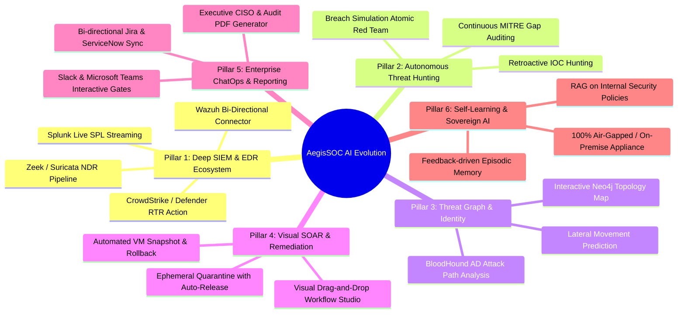

# AegisSOC AI: Strategic Roadmap & Future Enhancement Plan

---

## 1. Executive Vision

**AegisSOC AI** has established a modern foundation:
- 13 specialized autonomous agents (L1 Triage, L2 Investigation, L3 Response & Reporting).
- High-performance unified LLM Gateway (Bifrost) with multi-model routing and private proxy bridges.
- Dual-band Human-in-the-Loop approval architecture.
- Modular Model Context Protocol (MCP) integrations.

The objective of this roadmap is to transition AegisSOC AI from a reactive triage and investigation platform into a **fully sovereign, proactive, and predictive Autonomous Cyber Defense Operations Center**.

---

## 2. Strategic Pillars & Feature Roadmap



---

## 3. Detailed Architectural Enhancements

### Pillar 1: Deep SIEM, XDR & EDR Bi-Directional Ecosystem

| Capability | Current State | Target Future State | Priority |
| :--- | :--- | :--- | :--- |
| **Wazuh Bi-Directional Integration** | Manual API / Ingestion script | Native real-time streaming from Wazuh Manager & Indexer (OpenSearch), Wazuh Active-Response dispatcher triggered directly by AegisSOC approval actions. | **P0 (Immediate)** |
| **Splunk & Elastic / OpenSearch** | Basic read connector | Streaming SPL & EQL query executor tool allowing agents to run iterative queries across petabyte-scale data lakes during investigations. | **P1 (High)** |
| **EDR Real-Time Response (RTR)** | Mock / Webhook containment | Direct bi-directional integration with CrowdStrike Falcon, SentinelOne, and Microsoft Defender for Endpoint for live process termination, memory capture, and file quarantine. | **P1 (High)** |
| **Network Detection & Response (NDR)** | Synthetic NetFlow | Native Zeek/Suricata log parsers detecting DNS tunneling, abnormal JA3/JA4 SSL fingerprints, and domain generation algorithms (DGA). | **P2 (Medium)** |

#### **Wazuh Bi-Directional Architecture Detail:**
```
[Wazuh Agent on Endpoints]
         │ (Logs, FIM, Rootcheck, Syscheck)
         ▼
  [Wazuh Manager] ───────► [Wazuh Indexer / OpenSearch]
         │                              ▲
         │ (Webhooks / REST API)        │ (Search Queries)
         ▼                              │
┌────────────────────────────────────────────────────────┐
│                    AegisSOC AI                         │
│  - Event Consumer: Ingests alerts in real time         │
│  - Triage Agent: Evaluates anomaly & false positives   │
│  - Responder Agent: Formulates Active Response action  │
│  - Human-in-the-Loop Gate: Analyst clicks 'Approve'    │
└──────────────────────────┬─────────────────────────────┘
                           │ (Active Response Command)
                           ▼
[Wazuh Manager: /var/ossec/bin/agent_control -b <IP> -f <Script>]
```

---

### Pillar 2: Autonomous Threat Hunting & Purple Teaming (L3+ Tier)

1. **Continuous Threat Intelligence Assimilation**:
   - Automated RSS / MISP / AlienVault OTX / CISA advisories crawler.
   - When a new Zero-Day or APT campaign is reported, an autonomous agent extracts all IOCs (IPs, hashes, domain names, YARA rules, Sigma rules) and triggers **Retroactive Threat Hunting** across the organization's past 90 days of telemetry.
2. **Detection-as-Code (DaC) Optimization**:
   - Agent audits current detection rules against the **MITRE ATT&CK Matrix**.
   - Generates automated recommendations for missing detection rules (Sigma/Splunk SPL/YARA) for uncovered adversary techniques.
3. **Automated Purple Team Emulation Validation**:
   - Integration with **Atomic Red Team** and **Caldera**:
   - Safely executes simulated adversary behaviors in lab or designated test systems to verify that AegisSOC agents trigger and alert with 100% fidelity.

---

### Pillar 3: Attack Graph & Active Directory Identity Defense

1. **Identity & Privilege Graph Engine**:
   - Ingests Active Directory and Azure AD/Entra ID graphs (integrating BloodHound / SharpHound data).
   - When a user account is flagged (e.g. `smit.admin`), the agent correlates:
     - Which Domain Admins does this user have access to?
     - Are Kerberoastable SPNs associated with this session?
     - Is unconstrained delegation enabled on the target host?
2. **Visual Attack Path Explorer**:
   - An interactive canvas in the Web Console displaying the adversary's entry point, compromised workstations, pivot points, and target crown jewels in real-time.

---

### Pillar 4: Visual SOAR & Low-Code Workflow Studio

1. **Visual Drag-and-Drop Workflow Builder**:
   - Allow security engineers to design and customize multi-agent workflows visually directly in the Web Console without writing Python or YAML:
     - Drag blocks: *Trigger (Wazuh alert)* $\to$ *Triage Agent* $\to$ *Condition (Severity > High)* $\to$ *Investigator Agent* $\to$ *Approval Gate* $\to$ *Action (Isolate Host + Notify Teams)*.
2. **Safety Rollback & Ephemeral Containment**:
   - **VM Snapshots**: Before executing a disruptive containment action (e.g., stopping database services or isolating critical servers), automatically trigger a hypervisor snapshot (VMware, Proxmox, AWS EC2, Azure VM).
   - **Auto-Release Timers**: Quarantine actions can be assigned an auto-expiration window (e.g., 60 minutes) to prevent prolonged business interruption if investigation confirms benign administrative activity.

---

### Pillar 5: ChatOps & Enterprise Collaboration

1. **Slack & Microsoft Teams Interactive Action Bot**:
   - High-severity incidents send a rich card to `#soc-alerts`:
     ```
     🚨 [AegisSOC Critical Alert] Operation Phantom Dump
     Target: ws-finance-042 | Technique: T1003.001 (LSASS Dump)
     Confidence: 96.5% | Recommended Action: Isolate Workstation
     [Approve Isolation] [Reject] [Open Investigation Console]
     ```
   - Clicking **Approve** directly executes the action via AegisSOC API with cryptographic analyst identity verification.
2. **Two-Way ITSM & Ticket Synchronization**:
   - Real-time bi-directional sync with **Jira Service Management**, **ServiceNow**, and **TheHive**.
   - Synchronizes comments, notes, resolution playbooks, and closure statuses automatically.
3. **Automated CISO & Executive PDF Briefings**:
   - One-click generation of executive summaries, Root Cause Analysis (RCA) documents, and compliance audit packages formatted for executive leadership and external auditors.

---

### Pillar 6: Sovereign, Self-Learning AI & Local RAG

1. **Enterprise Security RAG (Retrieval-Augmented Generation)**:
   - Ingest organization-specific security policies, network diagrams, standard operating procedures (SOPs), and asset criticality tiers into a vector store (e.g. Qdrant / pgvector).
   - Agents automatically reference internal company rules (e.g., *"Is server DB-PROD-01 allowed to communicate with external IP X?"*).
2. **Self-Correcting Episodic Memory**:
   - When an analyst rejects an AI recommendation or tags an alert as a false positive, AegisSOC indexes the analyst's written rationale into **Episodic Memory**.
   - The next time identical behavior occurs under similar environmental context, the agents recognize the historical feedback and adjust their severity scoring accordingly.
3. **100% Air-Gapped Sovereign Deployment**:
   - Standalone appliance mode utilizing local high-performance quantized LLMs (e.g., Qwen 2.5 Coder 32B, Llama-3.3-70B, DeepSeek-R1-Distill) running via vLLM on local GPU clusters (NVIDIA A100/H100/RTX 6000) for zero external data egress.

---

## 4. Multi-Tenant Architecture for MSSP (Managed Security Service Providers)

For organizations or cybersecurity firms managing security operations across multiple clients:
- **Tenant Isolation**: Separate customer workspaces with row-level security (RLS) in PostgreSQL.
- **Cross-Tenant Threat Correlation**: If Customer A is targeted by a novel threat actor IP or hash, AegisSOC securely disseminates threat reputation across all tenant boundaries without leaking customer telemetry.
- **Custom Whitelists per Tenant**: Customer-specific false positive thresholds and maintenance schedules.

---

## 5. Phased Implementation Roadmap

```
Phase 1 (Months 1–2): Core Ecosystem Integration
├── Native Wazuh bi-directional connector (ingest + active response)
├── Interactive Slack / Microsoft Teams approval bot
└── Local RAG for internal SOC SOPs & network topology

Phase 2 (Months 3–4): Graph & Proactive Defense
├── Active Directory / Identity Attack Graph explorer
├── Automated Retroactive Threat Hunting against CISA/MISP feeds
└── Ephemeral containment & hypervisor snapshot triggers

Phase 3 (Months 5–6): Visual SOAR & Sovereign Appliance
├── Visual Drag-and-Drop Workflow Studio in Web Console
├── Automated Executive & Compliance PDF Report Generator
└── 100% Air-gapped on-premise deployment bundle with local vLLM
```

---

*Document generated by AegisSOC AI Engineering Team — Version 1.0*
