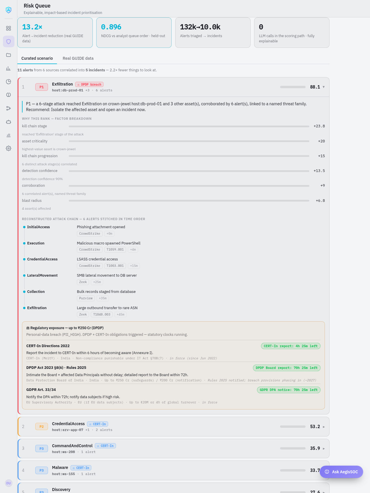

# AegisSOC AI

<div align="center">


<p align="center">
  <strong>AI-driven, explainable, risk-based SOC incident triage</strong><br/>
  <em>CyberKawach — Problem E1</em>
</p>

[](LICENSE)
[](.python-version)
[](core/risk/scoring.py)
[](core/risk/benchmark.py)

</div>

---

## The problem (E1)

A SOC drowns in alerts. **AegisSOC AI** ingests a multi-tool alert stream, **correlates**
related alerts into incidents, **scores each by real-world impact**, and outputs an
**explainable, prioritised queue** — every rank carrying the reason it earned, and the
multi-stage attack it belongs to reconstructed as a timeline.

Where most triage engines are black-box classifiers, ours is **deterministic and fully
auditable**: zero LLM calls in the scoring path.

```
 raw alerts (multi-tool)          correlation             scoring            queue
 CrowdStrike / Zeek / Purview  →  union-find on       →  6-factor       →  P1–P4,
 Suricata / Entra ID / Umbrella   shared entity +        impact score      ranked,
                                   time window           (0–100)           each explained
                                        │                                     │
                                        └── keeps the alerts, time-ordered ───┘
                                            = the reconstructed attack chain
```

<div align="center">

<br/><em>The P1 incident: six alerts from three tools stitched into one kill chain, every rank explained.</em>
</div>

---

## How it works

### 1. Correlation — stitching alerts into incidents (union-find)
Every alert is indexed by the **entities** it touches (host, user, IP). Using a
**disjoint-set (union-find)** structure, alerts that share an entity and fall within a
**60-minute** window of a neighbour are merged into one incident. Transitive merges
reconstruct the whole intrusion: a phishing alert on a workstation and an exfiltration
alert on a database are linked through the hosts the attacker moved across — even though
they never share a timestamp. It's `O(n·α(n))`, deterministic, and needs no training.

The correlated alerts are kept **in time order** — that ordered list *is* the
reconstructed attack chain, shown stage-by-stage with the tool and technique that raised
each one.

### 2. Scoring — 6 explainable impact factors (no LLM)
Each incident gets a 0–100 impact score = a weighted sum of six factors, each emitting a
plain-English reason the analyst sees:

| Factor | Weight | What it measures |
|---|---|---|
| Kill-chain stage | 25 | how far down the kill chain the attack reached (Exfiltration ≫ Recon) |
| Asset criticality | 20 | value of the most important affected asset (crown-jewel > server > workstation) |
| Kill-chain progression | 15 | how many distinct stages were stitched together |
| Blast radius | 15 | how many assets are involved |
| Detection confidence | 15 | how sure we are it's real |
| Corroboration | 10 | how many alerts agree, and whether a named threat family is attached |

Score → band → action: **P1 ≥ 75** (isolate now) · **P2 ≥ 50** (assign this shift) ·
**P3 ≥ 25** (queue for review) · **P4 < 25** (auto-close).

### 3. Regulatory-exposure overlay
Independently of the risk score, each incident is mapped to its breach-notification
obligations — **DPDP Act 2023, CERT-In 2022, GDPR** — with live statutory countdown
clocks, so the analyst sees the legal deadline alongside the technical severity.

---

## Results

Benchmarked on **Microsoft GUIDE** (9,980 real incidents with analyst triage grades and a
real analyst queue ranking):

- **NDCG 0.896** vs the real Microsoft analyst queue order (strong top-of-queue agreement) — *with a rationale on every rank, where the baselines are black boxes*
- **13.2× reduction** — 132k alerts triaged down to ~10k incidents
- **~17s** over a 1 GB stream at flat memory
- **0 LLM calls** in the scoring path — fully explainable and reproducible

---

## Quickstart

```bash
# Full console demo (first run provisions a venv + deps — a few minutes)
./demo_up.sh
# → http://localhost:7788  → "Risk Queue" → expand the top P1 incident

# Or headless, instant (no stack):
PYTHONPATH=$PWD python3 -m core.risk            # the full explained queue, P1 = 88.1
PYTHONPATH=$PWD python3 -m core.risk.benchmark  # NDCG 0.896 vs real analysts
```

The precomputed results ship in `build/dashboard_data.json`, so the console renders the
queue + attack chain immediately on clone. See **[`START_HERE.md`](START_HERE.md)** and the
full walkthrough in **[`core/risk/ATTACK_CHAIN_REVIEW.md`](core/risk/ATTACK_CHAIN_REVIEW.md)**.

## The engine (core work) — `core/risk/`
| File | Role |
|---|---|
| `scenario.py` | curated demo alert stream (6 tools, "Operation Ledger") |
| `correlate.py` | union-find correlation → reconstructed attack chain |
| `scoring.py` | deterministic 6-factor impact score → P1–P4 |
| `guide.py` · `benchmark.py` · `calibrate.py` | scale + evaluation on Microsoft GUIDE |
| `compliance.py` | DPDP / CERT-In / GDPR regulatory-exposure overlay |
| `dashboard.py` | serialises the queue for the console + API |

Dataset: see **[`datasets/README.md`](datasets/README.md)** (a sample + full analyst-ranking
ground truth ship in-repo; a downloader fetches the full GUIDE set for re-running the benchmark).

---

## Q&A — the questions this project answers

**Q: Do you turn low-level alerts into a full attack chain?**
Yes — *defensive attack-chain reconstruction*. Correlation stitches individually-minor
alerts that share entities within a time window into one multi-stage incident, and the
progression factor escalates a chain above isolated alerts. In the demo, six low/medium
alerts from three tools become one **P1 (88.1)** because they chain
phishing → execution → LSASS credential dump → lateral move → staging → exfiltration onto a
crown-jewel database.

**Q: How exactly do you correlate the alerts?**
Union-find (disjoint-set). Alerts are indexed by the entities they touch; alerts sharing an
entity within a 60-minute window are unioned, and transitive unions merge the full chain
across hosts. Deterministic, `O(n·α(n))`, no training. The members are kept time-ordered to
reconstruct the sequence.

**Q: Is this the same as predicting an exploit path from vulnerabilities?**
No — and we're precise about it. We chain **alerts that already fired** and prioritise by
impact (detection-side). Predicting exploit paths from raw vulnerabilities + topology is
offensive attack-graph work (BloodHound territory) — on the roadmap, not a claim made today.

**Q: Which tools / data sources does it work with?**
Multi-source detections, not raw packets: **EDR (CrowdStrike), NDR (Zeek), IDS/IPS
(Suricata), DLP (Purview), Identity (Entra ID), DNS security (Umbrella)** in the demo. The
schema is vendor-neutral — any detection with an entity, timestamp and ATT&CK tactic plugs in.

**Q: Is the risk score a black box / ML model?**
No. It's a deterministic weighted sum of six impact factors, each with a visible sub-score
and reason. **Zero LLM calls in scoring.** Every rank is auditable — exactly what E1 asks for.

**Q: Aren't the weights just made up?**
Two profiles: a transparent hand-tuned profile (the knob a SOC calibrates), and a profile
learned by **non-negative least squares against real Microsoft analyst rankings** on
held-out orgs — still interpretable (just weights). It confirmed analysts prioritise by
asset value + attack progression over single-tactic severity.

**Q: How good is it — evidence?**
On 3,000 held-out real incidents it reproduces the Microsoft analyst queue order at
**NDCG 0.896**, with a **13.2×** alert→incident reduction — and unlike the black-box
baselines, every ranking carries its rationale.

**Q: Does the model ever see the ground-truth label?**
Never. Analyst grades (TP/BP/FP) and the analyst queue ranking are used only to *measure*
the engine after the fact — never as scoring inputs.

---

## Underlying platform
The risk-triage engine runs on top of an agentic SOC platform (FastAPI + React, an agent
layer, and Model Context Protocol integrations). The **explainable, impact-based
risk-triage and attack-chain reconstruction** — the E1 contribution — is the work in
`core/risk/` and the console **Risk Queue** screen.

## License
[Apache 2.0](LICENSE).
